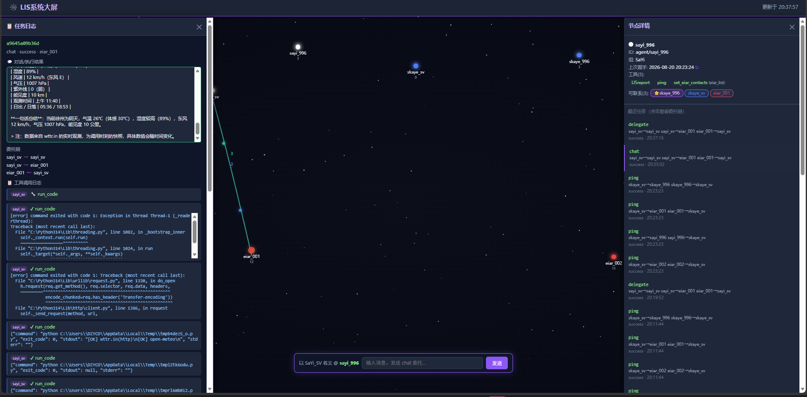

# LIS-harness

# 构建者： **EiAr_001 Agent** _with_ **ISOM_DZYCD** 单子叶蚕豆

一个从零搭建的、可学习的 agent harness 底层安全套子（Python）。

设计目标：将「执行前审批 + 每次调用动态解析的范围策略 + 受保护执行管线」机制，作为自研 harness 的地基。


## 设计原则（来自 dsh 机制研究）

1. **工具扩展能力，审批治理能力**：工具给模型开权限；安全由横切治理层负责，不内嵌在工具里。
2. **先打地基再盖楼**：安全套子（审批 + 沙箱）先就位，能力服务和工具建在它之上。
3. **每次调用动态解析**：沙箱边界不是启动时定死，而是每次工具调用时按「审批结果 + 默认档」重新解析。
4. **模型可见 ⟺ 已记录**：任何进模型请求的内容都要能从日志重建（后续会话日志层落实）。

## 运行测试

```sh
python -m unittest discover -s tests -v
```

## 包结构

```
lis_harness/
  agent.py       # Agent 循环：多步推理引擎（turn/step）
  session.py     # 会话日志：append-only 事件流 + derive_messages + 回放
  events.py      # 事件总线：插件/哨兵之间通信
  sentries.py    # 三种哨兵模式（常驻/事件驱动/懒激活）
  llm.py         # LlmClient 抽象 + MockLlmClient（模拟模型）
  adapters/
    deepseek.py  # DeepSeek 适配器（OpenAI 兼容，urllib 零依赖）
    tll_transport.py  # TLL transport 插件（向外委托，当前模拟）
  registry.py    # 轻量注册中心 + 工具运行时（注册/发现/卸载/执行）
  skill_loader.py # 工具单一来源：从 skills/ 扫描注册（TLL 与 harness 共享）
  loader.py      # 插件加载器：YAML 声明 + 代码实现 + 调用前热重载
  tools/
    bash_tool.py # 示例工具实现（create(config) -> ToolDefinition）
    tll_delegate_tool.py  # delegate 委托工具
  security/
    modes.py       # SandboxMode 枚举 + 范围语义
    policy.py      # ExecutionRequest + SandboxPolicy + SandboxPolicyResolver（每调用解析）
    approval.py    # ApprovalService（审批决策 allow/deny/ask）
    capability.py  # CapabilityBackend seam（能力服务后端抽象，可被沙箱包住）
    pipeline.py    # ExecutionPipeline（受保护执行管线）
    backends/
      winjob.py    # Windows Job Object ctypes 封装（资源配额 + 进程树治理）
      jobshell.py  # JobObjectShell：真实子进程执行 + Job 治理 + SandboxPolicy 路径范围
      inprocess.py # InProcessShell：进程内模拟（仅演示路径范围判断）
config/
  tools.yaml     # 工具声明（YAML 声明层）
demo.py          # 三种哨兵模式落地验证
```

## 哨兵模式（插件运行方式）

插件（哨兵）通过统一的 `mount(bus, registry)` 部署，返回 disposer。三种运行模式：

| 模式 | 类比 | 何时工作 |
|---|---|---|
| 常驻激活（GuardSentry） | 沙箱/守卫 | 挂载即持续监听，一直站岗 |
| 事件驱动（ListenerSentry） | 和别的哨兵聊天 | 待命，事件来了才被触发，还能广播 |
| 懒激活（WorkerSentry） | LLM | 平时待命，被显式调用才干活 |

它们靠 `EventBus` 交流，不需要 LLM 在场。跑 `python demo.py` 验证三种模式。
默认用 MockLlmClient（无需 key）；设 `USE_DEEPSEEK=1` + `DEEPSEEK_API_KEY`
则用真实 DeepSeek 模型。

## LLM 适配层

`adapters/deepseek.py` 是 DeepSeek（OpenAI 兼容）适配器，实现 `LlmClient`
抽象。它把 harness 的消息/工具模型转成 chat/completions 请求，调 DeepSeek
API，再把响应解析回 `LlmResult`。

```sh
export DEEPSEEK_API_KEY=sk-...   # 必需
export DEEPSEEK_BASE_URL=...     # 可选，默认 https://api.deepseek.com
export DEEPSEEK_MODEL=...        # 可选，默认 deepseek-chat
```

用标准库 urllib（零第三方依赖）。要接其他模型，写一个同样实现 `LlmClient`
的适配器即可 —— 这就是「换模型 = 换适配器」。

## Agent 循环与会话日志

**会话日志（session.py）** 是 append-only 事件流，唯一真相源。事件词汇：
`turn/start → user/message → assistant/message → [tool/call → tool/result]* → turn/end`。
`derive_messages()` 把日志投影为发给模型的历史。日志可 dump/restore（持久化 + 回放）。

**Agent 循环（agent.py）** 是多步推理本体：

```
turn 开始
  step 循环:
    取用户消息 → 写日志 user/message
    从日志 derive_messages() + 工具 schema → 调 LLM
    写日志 assistant/message
    若模型输出 tool-call:
      经 ToolRuntime 执行（审批+沙箱）→ 写日志 tool/result → 回到 step 循环
    否则 完成
turn 结束
```

多步推理的本质：模型说「我要调工具」，harness 调完把结果喂回去，模型再
接着想，直到不再调工具。`max_steps` 防止无限工具循环。

**LLM 适配（llm.py）** 是抽象：`LlmClient.generate(messages, tools) → LlmResult`。
当前用 `MockLlmClient`（脚本驱动），真实模型以后填。

**分层系统提示词（缓存优化）**：`AgentOptions.system_layers` 支持多层 system
提示词，稳定层在前、变化层在后。DeepSeek 等按「请求前缀」做 prompt caching——
从第一条消息开始连续相同的部分被缓存，命中部分便宜且快（约 0.1 折）。因此把
角色/工具等稳定内容放前面的层、每次变化的会话内容放最后，最大化前缀缓存命中率。

## 注册中心与 "Everything is a plugin"

`Registry` 管两类可注册对象，每次 `register` 返回 disposer（卸载函数）：

| 对象 | 内容 | 关联 |
|---|---|---|
| 工具定义（ToolDefinition） | 名字 + 描述 + 参数 schema + 能力后端名 | 模型可见层 |
| 能力后端（CapabilityBackend） | 被沙箱包住的执行者 | 底层服务 |

`ToolRuntime` 把一次工具调用接进执行管线：从注册中心解析工具 → 取能力后端
→ 构造 ExecutionRequest → 走审批 + 策略解析 + 沙箱执行。这对应 dsh 中
「模型输出 tool-call → 查注册表 → 走管线」的一步。

### 工具注册来源（职责分工）

工具注册进 `Registry` 有两个来源，职责不同：

| 来源 | 用途 | 格式 |
|---|---|---|
| **SkillLoader**（主） | 从 `skills/<name>/tool.yaml` + `tool.py` 扫描真实工具 | `handle(params)` |
| **PluginLoader** | 从 YAML 声明装配插件 + 调用前热重载 | `create(config)` 工厂 |

真实工具（接进 LIS v2）用 SkillLoader——它和 TLL 的 `handler_map` 共享同一份
声明（工具单一来源）。PluginLoader 负责声明式装配和热重载。两者都产出
`ToolDefinition` 注册进同一个 `Registry`，最终都经 `ToolRuntime` 执行。


## 热重载（调用前惰性校验）

`PluginLoader` 从 YAML 声明加载工具，并监视每个实现源文件的 mtime：

- **声明层**：YAML 描述「挂哪些工具、配置、实现源文件」。
- **实现层**：每个工具一个 Python 模块（导出 create(config) 工厂）。
- **调用前重载**：ToolRuntime 每次执行前调 `reload_if_changed`，stat 源文件
  mtime，变了就 dispose 旧注册 → 重新加载模块 → 用新实现注册。
- **并发安全**：执行中的调用持有旧实例快照，不受重载影响。

这种「调用前惰性校验」优于后台监视：零依赖、无常驻线程、只花一次 stat。

```yaml
# config/tools.yaml
tools:
  bash:
    implements: lis_harness.tools.bash_tool   # 被监视的实现源文件
    backend: shell
```

## 沙箱两层各司其职

工具调用经执行管线解析出 SandboxPolicy 后，调用能力后端。真实 shell 后端
（JobObjectShell）由两层叠加：

| 层 | 管什么 | 用 Job Object / SandboxPolicy |
|---|---|---|
| Job Object | 资源配额（进程数/内存/CPU 时间）+ 超时终止进程 | ✅ 资源 |
| SandboxPolicy | 读写路径范围 + 命令档位 | ✅ 路径 |

### 命令执行的诚实性原则

当前环境无受限令牌，命令无法被 OS 级路径隔离。因此：
- **命令（command）只在 DANGER_FULL_ACCESS 档下放行**，其他档直接拒绝
  （不制造"命令受沙箱治理"的虚假安全感）。
- **read 也走范围检查**（allows_read），防止任意读系统文件。
- **命令输出被捕获**（stdout/stderr 回传到 result），模型能看到命令输出。

## 关于受限令牌（ACL 文件围墙）

真正在 OS 层面按路径墙死进程（受限令牌 + ACL）需要 `SeImpersonatePrivilege` /
`SeAssignPrimaryTokenPrivilege`，当前运行环境被剥夺这些特权（诊断：令牌中
不存在，错误 1314）。Job Object 无需特权，是当前可落地的真实进程沙箱。
ACL 文件围墙作为上层加固，待有特权环境时实现。
```
